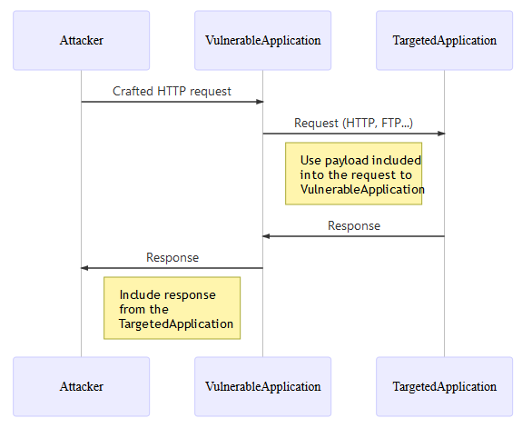

<!-- theme: default -->
<!-- paginate: true -->
<!-- footer: Copyright (c) by **Bjoern Kimminich** | Licensed under [CC-BY-SA 4.0](https://creativecommons.org/licenses/by-sa/4.0/) -->

# Authorization Flaws

---

# [Broken Access Control](https://owasp.org/Top10/A01_2021-Broken_Access_Control/)

Access control is supposed to prevent that users can act outside of
their intended permissions.

##### Possible Impact of Broken Access Control

* Access unauthorized functionality and/or data, such as access other
  users' accounts
* View sensitive files
* Modify other users' data
* Change access rights

---

##### Common Attacks

* Modifying URL, internal application state, or HTML page
* Changing the primary key to another users record
* Elevation of privilege
  * Acting as a user without being logged in
  * Acting as an admin when logged in as a user

_:information_source: Obtaining a higher level of access is also
referred to as **Vertical** Privilege Escalation while same-level access
to another user's data is called **Horizontal** Privilege Escalation._

---

* Metadata manipulation
  * Replaying or tampering with access control tokens
  * Cookie or hidden field manipulation
* Force browsing to authenticated pages as an anonymous user or to
  privileged pages as a standard user
* Accessing API with missing access controls for `POST`, `PUT` and
  `DELETE`

---

# Data Factors

## A01:2021 – Broken Access Control

| CWEs Mapped | Max Incidence Rate | Avg Incidence Rate | Avg Weighted Exploit | Avg Weighted Impact | Max Coverage | Avg Coverage | Total Occurrences | Total CVEs |
|:-----------:|:------------------:|:------------------:|:--------------------:|:-------------------:|:------------:|:------------:|:-----------------:|:----------:|
|     34      |       55.97%       |       3.81%        |         6.92         |        5.93         |    94.55%    |    47.72%    |      318,487      |   19,013   |

---

# Exercise 5.1

Assuming no access control is in place, which privilege escalations are
possible by tampering with the following URLs?

1. `http://logistics-worldwi.de/showShipment?id=40643108`
2. `http://my-universi.ty/api/students/6503/exams/view`
3. `http://document-warehou.se/landingpage?content=index.html`

---

# Exercise 5.2

1. Access the administration section of the store (:star::star:)
2. View another user's shopping basket (:star::star:)
3. Get rid of all 5-star customer feedback (:star::star:)
4. Post some feedback for another user but without previously logging in
   as that user (:star::star::star:)

---

# [Prevention](https://owasp.org/www-project-top-ten/OWASP_Top_Ten_2017/Top_10-2017_A5-Broken_Access_Control)

* **Access control** is only effective if **enforced in trusted
  server-side code**
* With the exception of public resources, **deny by default**
* **Implement** access control mechanisms **once and re-use** them
  throughout the application
* **Enforce record ownership**
* **Disable web server directory listing** and ensure file metadata and
  backup files are not present within web roots

---

* **Log access control failures**, alert admins when appropriate
* Rate limit API and controller access to minimize the harm from
  automated attack tooling
* Access tokens should be invalidated on the server after logout
* Developers and QA staff should include functional access control unit
  and integration tests

---

## [Access Control Design Principles](https://wiki.owasp.org/images/b/bc/OWASP_Top_10_Proactive_Controls_V3.pdf)

1. Design Access Control thoroughly up front
2. Force all Requests to go through Access Control checks
3. Deny by Default
4. Principle of Least Privilege
5. Don't hardcode roles
6. Log all Access Control events

---

# Exercise 5.3 (:house:)

1. Place an order with a negative total (:star::star::star:)
2. Access one or more misplaced files (:star::star::star::star: -
   :star::star::star::star::star::star:)

---

# SSRF

## Server-Side Request Forgery

---

# Server-Side Request Forgery

> SSRF flaws occur whenever a web application is fetching a remote resource without validating the user-supplied URL. It allows an attacker to coerce the application to send a crafted request to an unexpected destination, even when protected by a firewall, VPN, or another type of network access control list (ACL).
>
> As modern web applications provide end-users with convenient features, fetching a URL becomes a common scenario. As a result, the incidence of SSRF is increasing. Also, the severity of SSRF is becoming higher due to cloud services and the complexity of architectures. \[[^1]\]

[^1]: https://owasp.org/Top10/A10_2021-Server-Side_Request_Forgery_%28SSRF%29/#description

---

# Attack Vector Examples

> * Image on an external server (e.g. user enters image URL of their avatar for the application to download and use).
> * Custom WebHook (users have to specify Webhook handlers or Callback URLs).
> * Internal requests to interact with another service to serve a specific functionality. Most of the times, user data is sent along to be processed, and if poorly handled, can perform specific injection attacks. \[[^2]\]

[^2]: https://cheatsheetseries.owasp.org/cheatsheets/Server_Side_Request_Forgery_Prevention_Cheat_Sheet.html#context

---

# SSRF Common Flow

<!-- _footer: ©Copyright 2021 - CheatSheets Series Team, used under CC-BY 3.0 -->

---

# Data Factors

## A10:2021 – Server-Side Request Forgery (SSRF)

| CWEs Mapped | Max Incidence Rate | Avg Incidence Rate | Avg Weighted Exploit | Avg Weighted Impact | Max Coverage | Avg Coverage | Total Occurrences | Total CVEs |
|:-----------:|:------------------:|:------------------:|:--------------------:|:-------------------:|:------------:|:------------:|:-----------------:|:----------:|
|      1      |       2.72%        |       2.72%        |         8.28         |        6.72         |    67.72%    |    67.72%    |       9,503       |    385     |

---

# [Prevention](https://owasp.org/Top10/A10_2021-Server-Side_Request_Forgery_%28SSRF%29/#how-to-prevent)

## Network Level

- Segmenting remote resource access functionality in separate networks
- Enforcing “deny by default” firewall policies or network access
    control rules to block all but essential intranet traffic
  - Establishing ownership/lifecycle for firewall rules based on applications
  - Logging all accepted *and* blocked network flows on firewalls
    (see [Security Logging and Monitoring Failures](02-09-sdlc.md#security-logging-and-monitoring-failures))

---

## Application Level

-   Sanitizing and validating all client-supplied input data
-   Enforcing the URL schema, port, and destination with a positive allow list
-   Not sending raw responses to clients
-   Disabling HTTP redirections
-   Awareness of URL consistency to avoid attacks such as DNS
    rebinding and “time of check, time of use” (TOCTOU) race conditions

# Exercise 5.4 (_optional_ :house:)

1. Reverse engineer a [juicy malware](https://github.com/juice-shop/juicy-malware) and use what you learn from it...
2. ...to request a hidden resource on server through server (:star::star::star::star::star::star:)

_:information_source: For this to count as an SSRF attack you need to make the Juice Shop server attacks itself._  
